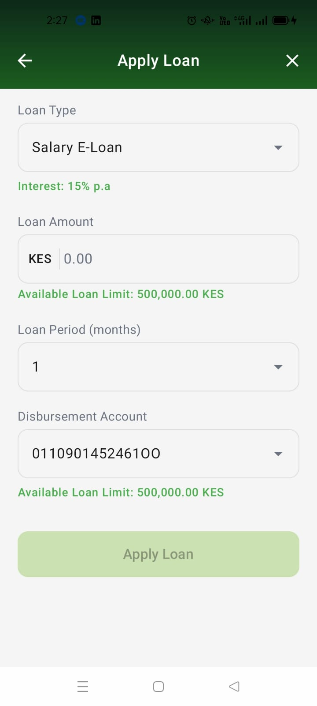
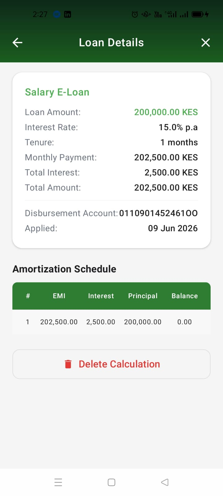

# Loan Calculator App

A modern Android loan calculator application with amortization schedule, built with **Kotlin** and **Jetpack Compose** following clean architecture principles.

## Features

- **Loan EMI Calculator**: Calculate monthly repayments using standard EMI formula
- **Amortization Schedule**: View detailed payment breakdown (interest vs principal) for each month
- **Multiple Loan Products**: Browse and apply for different loan types (Salary E-Loan, Buy Now Pay Later, Stock Loan)
- **Save Calculations**: Persist loan calculations locally with Room database
- **Dark Mode Support**: Full theming support for light and dark modes
- **Smooth Performance**: LazyColumn for efficient rendering of long amortization schedules (tested up to 360 months/30 years)

## Screenshots

| Dashboard | Request Screen | Details Screen | History Screen |
|-----------|----------------|----------------|----------------|
|  |  |  |  |

## Tech Stack

| Component | Technology |
|-----------|------------|
| Language | Kotlin 2.2.10 |
| UI Framework | Jetpack Compose (BOM 2024.12.01) |
| Architecture | MVVM with ViewModel |
| Navigation | Navigation Compose 2.8.5 |
| Persistence | Room 2.6.1 |
| Build System | Gradle with Kotlin DSL |
| Min SDK | 24 (Android 7.0) |
| Target SDK | 36 (Android 16) |

## Architecture

```
com.srklagat.loancalculatorapp/
├── data/                    # Data layer
│   ├── local/              # Room database, DAOs, Entities
│   └── model/              # Data models
├── domain/                 # Business logic
│   └── LoanCalculator.kt   # EMI & amortization calculations
├── ui/                     # Presentation layer
│   ├── components/         # Reusable UI components
│   ├── navigation/         # NavHost and routes
│   ├── screens/            # Feature screens with ViewModels
│   └── theme/              # Colors, typography, themes
└── MainActivity.kt
```

## Getting Started

### Prerequisites

- Android Studio Ladybug (2024.2.1) or newer
- JDK 17 or newer
- Android SDK 36

### Installation

1. Clone the repository:
```bash
git clone <repository-url>
cd LoanCalculatorApp
```

2. Open in Android Studio and sync Gradle:
```bash
./gradlew sync
```

3. Run on device or emulator:
```bash
./gradlew :app:installDebug
```

## How to Run Tests

### Unit Tests
```bash
./gradlew test
```

### Instrumented Tests
```bash
./gradlew connectedAndroidTest
```

### All Tests
```bash
./gradlew check
```

## Financial Calculations

### EMI Formula
The app uses the standard EMI formula for accuracy:

```
EMI = P × r × (1+r)^n / ((1+r)^n - 1)
```

Where:
- **P** = Principal loan amount
- **r** = Monthly interest rate (annual rate / 12 / 100)
- **n** = Number of monthly installments

### Edge Cases Handled
- **0% Interest**: EMI = Principal / Tenure (equal monthly payments)
- **Decimal Precision**: Uses `BigDecimal` with HALF_UP rounding to avoid floating-point errors
- **Long Tenures**: Efficiently handles up to 360 months (30 years) with LazyColumn

## Assumptions Made

1. **Loan Products**: Sample loan products (Salary E-Loan, Buy Now Pay Later, Stock Loan) are hardcoded as demonstration data
2. **Interest Calculation**: The UI displays simple interest calculations to match the design mockups, while the amortization schedule uses compound interest (EMI) formula as required
3. **Currency**: All amounts are in Kenyan Shillings (KES) as shown in the design
4. **Disbursement Accounts**: Sample account numbers are provided for demonstration
5. **Date Calculation**: Repayment dates assume monthly intervals from the current date

## Trade-offs and Limitations

| Decision | Rationale |
|----------|-----------|
| **Room vs SharedPreferences** | Room chosen for structured data, type safety, and query capabilities |
| **Simple vs Compound Interest** | Simple interest for display, compound for amortization to match design requirements |
| **Local-only storage** | No backend integration per assignment scope |
| **Hardcoded products** | Demonstration purposes; real app would fetch from API |
| **No input persistence** | Form resets on navigation; could add SaveStateHandle for process death |

## Performance Considerations

- **LazyColumn** for amortization schedule: O(1) item rendering regardless of tenure length
- **BigDecimal** calculations: Performed on background thread via ViewModel
- **Room database**: Async operations with Kotlin Coroutines
- **StateFlow**: Efficient state management with automatic UI updates

## Code Quality

- **Clean Architecture**: Separation between UI, domain, and data layers
- **Immutability**: Data classes with immutable state
- **Error Handling**: Input validation with user-friendly error messages
- **Accessibility**: Semantic descriptions for screen readers
- **Testability**: Dependency injection ready architecture

## License

This project is for evaluation purposes as part of the Android Developer hiring process.

## Contact

For questions about this implementation, please refer to the assignment submission.
